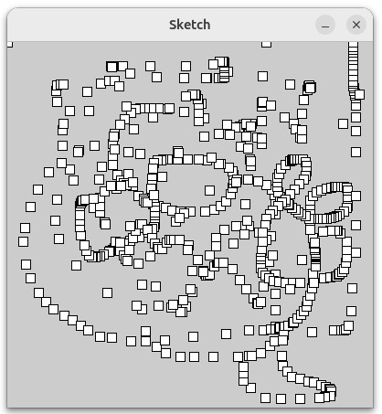

# Visual Designs using Python

- ejemplo-prueba.py

Is the first try in this project.
It prints small squares based on the mouse cursor movements across the screen. Each square is printed dynamically, leaving a visual trail that reflects the cursor's path.

<ul>The 2D figure can be:

<li>arc()</li>
<li>circle()</li>
<li>ellipse()</li>
<li>line()</li>
<li>lines()</li>
<li>point()</li>
<li>points()</li>
<li>quad()</li>
<li>rect()</li>
<li>square()</li>
<li>triangle()</li>
</ul>

